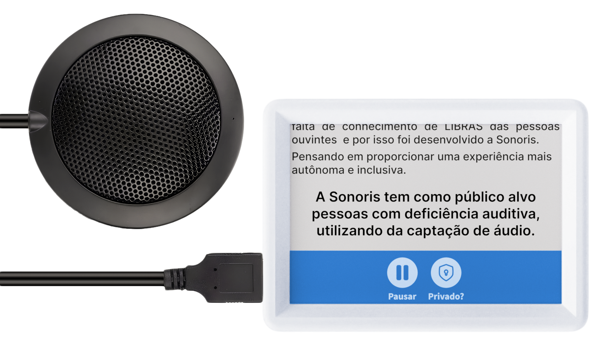
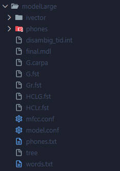

<div align=center>
  


</div>

<b>Sonoris</b> é um projeto, constituido por um aplicativo e um dispositivo, desenvolvido ao longo de 2025 em parceria com uma empresa, como parte do Trabalho de Conclusão de Curso (TCC) do curso de **Desenvolvimento de Sistemas AMS da Etec da Zona Leste**. **[Landing Page da Sonoris](https://sonoris.vercel.app/)**

# Sumário

- [🌟 Sobre a Sonoris](#-sobre-a-sonoris)
- [📖 Funcionalidades do dispositivo](#-funcionalidades-do-dispositivo)
- [💻 Tecnologias Utilizadas](#-tecnologias-utilizadas)
  - [Telas](#telas)
  - [Transcrição](#transcrição)
  - [Servidor BLE](#servidor-ble)
- [🚀 Como rodar o projeto](#-como-rodar-o-projeto)
- [📁 Outros repositórios](#-outros-repositórios)
- [😀 Contribuidores](#-contribuidores)

## 🌟 Sobre a Sonoris

O projeto tem como propósito facilitar a comunicação e promover a inclusão de **pessoas com deficiência auditiva**, principalmente em contextos profissionais e acadêmicos, utilizando transcrição de voz e opções de customização.

<div align=center>
  


</div>

## 📖 Funcionalidades do dispositivo

O dispositivo IoT que capta a fala humana por meio de um microfone omnidirecional e realiza a transcrição em um microcomputador Raspberry Pi. As legendas geradas são exibidas em um display LCD e também enviadas ao aplicativo mobile via Bluetooth.

Caso o usuário prefira, é possível ativar o modo privado, garantindo que as conversas captadas não sejam armazenadas no aplicativo.

Também é possível customizar as legendas do dispositivo, ajustando fonte, tamanho, espaçamento horizontal e outras preferências pelo aplicativo.

## 💻 Tecnologias utilizadas

### Telas:


### Transcrição:


### Servidor BLE:


## 🚀 Como rodar o projeto

```sh
# clone o repositório
git clone https://github.com/Chrb09/Sonoris-Raspberry-Pi.git

# acesse o diretório
cd Sonoris-RaspberryPi
```

Baixe o [vosk-model-pt-fb-v0.1.1-20220516_2113](https://alphacephei.com/vosk/models/vosk-model-pt-fb-v0.1.1-20220516_2113.zip), extraia os conteúdos em uma pasta chamada 'modelLarge' na root do projeto.



```python
# crie o ambiente virtual
python -m venv meu_ambiente_virtual

# ative o ambiente virtual
source meu_ambiente_virtual/bin/activate

# instale as dependências
pip install -r requirements.txt

# execute o script principal
python main.py
```

## 📁 Outros repositórios

- <b> [Aplicativo](https://github.com/Beatriz02020/Sonoris-iot-app-transcricao) </b><br>
- <b> [Landing Page](https://github.com/Amanda093/Sonoris) </b><br>
- <b> [Documentação](https://github.com/Beatriz02020/Sonoris-iot-app-transcricao/tree/documentation) </b>

## 😀 Contribuidores

<div align=center>
<table>
  <tr>
    <td align="center">
      <a href="https://github.com/Amanda093">
        <br>
        <sub>
          <b>Amanda</b>
        </sub> <br>
      </a>
    </td>
    <td align="center">
      <a href="https://github.com/Beatriz02020">
        <br>
        <sub>
          <b>Beatriz</b>
        </sub> <br>
      </a>
    </td>
    </td>
    <td align="center">
      <a href="https://github.com/Chrb09">
        <br>
        <sub>
            <b>Carlos</b>
          </sub> <br>
      </a>
    </td>
  </tr>
</table>
</div>
<br>
